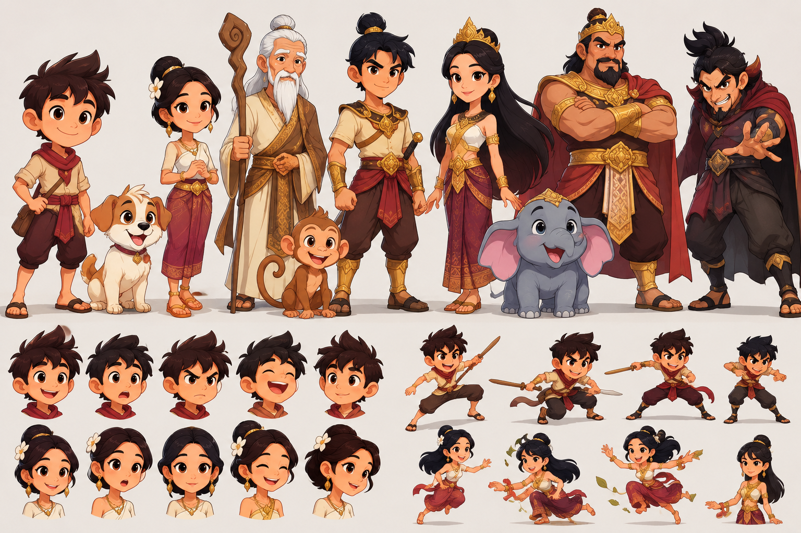
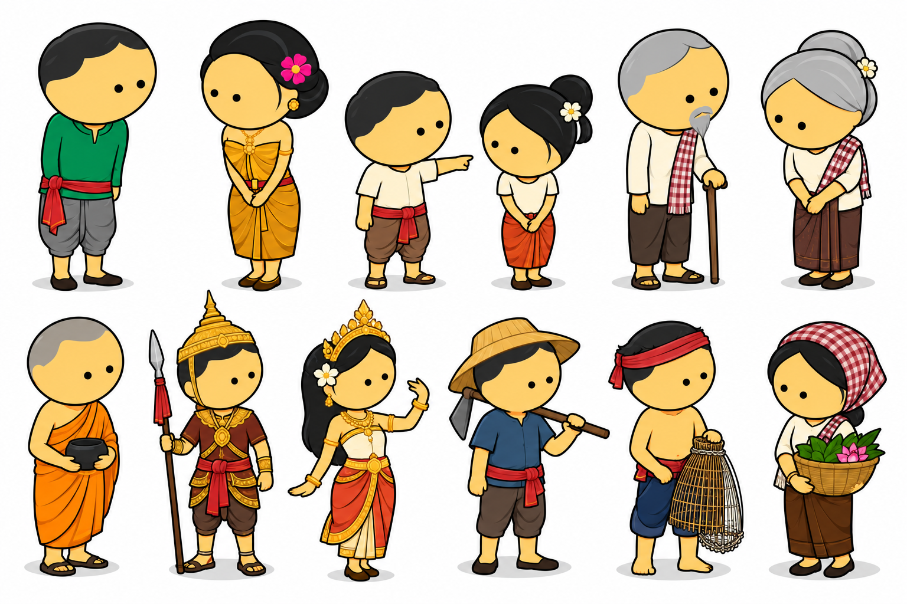
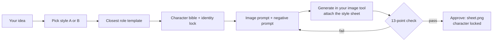

<h1 align="center">Khmer 2D Character Creator</h1>

<p align="center">
  <b>Design new Cambodian-inspired 2D cartoon characters that look the same in every scene.</b><br>
  A Claude Code skill: character bible → identity lock → image prompt → quality check.
</p>

<p align="center"></p>

## Contents
[What it does](#-what-it-does) · [Install](#-install) · [Quick start](#-quick-start) · [Two styles](#-two-styles) ·
[Characters](#-characters) · [Workflow](#-workflow) · [Identity lock](#-identity-lock) ·
[Quality check](#-quality-check) · [Files](#-files) · [Content care](#-content-care)

## ✨ What it does
| | |
|---|---|
| **Character bible** | Covers the name, role, age, personality, background, face, hair, body, clothes, hex palette, accessories (with which side) and props |
| **Model sheet plan** | Front, three-quarter, side and back views, 8–12 expressions and 6–10 action poses |
| **Identity lock** | The list of things that must never change, so the character looks the same in every scene |
| **Image prompts** | Ready-to-paste prompts for a character sheet, a cast lineup or a single scene, each with a negative prompt |
| **Quality check** | A 13-point pass/fail check of every image you generate |
| **Cast lineups** | A height ladder so characters never change scale between pictures |
| **Khmer identity** | Sampot, krama, gold belts, sandals and Angkor-era royal and warrior dress, used respectfully and without mixing in other cultures' costumes |

It works for Khmer folklore, history, motivational shorts, kids' lessons, YouTube, TikTok, Reels and
image-to-video tools.

## ⚡ Install
```bash
# in your project
git clone https://github.com/chydevit/khmer-2d-character-creator .claude/skills/khmer-2d-character-creator
# or for every project
git clone https://github.com/chydevit/khmer-2d-character-creator ~/.claude/skills/khmer-2d-character-creator
```
Then copy `examples/characters/` into your project as `characters/`. New characters are saved there.

## 🚀 Quick start
Ask Claude Code, for example:
- *"Create a new character: a fisherman grandfather who tells river stories, Style A."*
- *"Make a Style B character: a 6-year-old boy who loves drawing."*
- *"Write a cast lineup prompt for Dara, Malis, Lok Ta Sokha and Mother Sophea."*
- *"Here is the image I generated. Check it against Pisey's lock."*

Claude writes `characters/<name>/<name>.md` and `prompt.txt`. Paste the prompt into your image tool and
**attach that style's reference sheet**. Then share the result and approve it. The approved image becomes
`sheet.png` and the character is locked.

## 🎨 Two styles
Choose one style per film and never mix the two.

| | **Style A: Warm story** (default) | **Style B: Bright chibi** |
|---|---|---|
| Sheet | [`reference/master-style-sheet.png`](reference/master-style-sheet.png) | [`reference/style-b-bright-sheet.png`](reference/style-b-bright-sheet.png) |
| Look | Warm cream, maroon and gold, painted cel shading | Bright saturated colors, pure white background |
| Kids | About 4 heads tall, expressive and adventurous | About 3 heads tall, round and cute |
| Height unit | Dara = 1.00 | Green-shirt boy = 1.00 |
| Best for | Folklore, history, motivational films | Young children's lessons, songs, simple stories |

<p align="center"></p>

## 👥 Characters

### Style A: the Dara world (locked, see [`references/cast-bible.md`](references/cast-bible.md))
| Name | Role | Signature |
|---|---|---|
| **Dara** | Main young hero | Cream shirt, red krama scarf and sash, shoulder bag |
| **Malis** | Friend | High bun with a white plumeria, deep-red sampot |
| **Lok Ta Sokha** | Wise mentor | White beard, topknot, spiral wooden staff |
| **Veasna** | Young warrior | Topknot, gold guards, short sword |
| **Princess Bopha** | Royal leader | Very long hair, gold crown, white and maroon |
| **King Jayavuth** | King and protector | Tallest, gold crown and armor, red cape |
| **Rotha** | Antagonist | Dark red cape, goatee, sly grin |
| Puppy · Monkey · Baby elephant | Animal companions | Red collar · curled tail · gold head ornament |

Height ladder: Dara 1.00 · Malis 0.97 · Sokha 1.34 · Sophea 1.38 · Bopha 1.40 · Veasna 1.45 · Rotha 1.52 · King 1.60.

**Animated rigs:** all of them (plus Mother Sophea) are ready to walk, talk and act in films, in
[`create-animation-2d/engine/cast_dara.py`](https://github.com/chydevit/create-animation-2d/blob/main/engine/cast_dara.py).

<p align="center"></p>

### New characters (examples, in [`examples/characters/`](examples/characters/))
| Name | Style | Role | Status |
|---|---|---|---|
| **Mother Sophea** (ម្ដាយ សុភា) | A | Dara's mother, a rice farmer with a red-and-cream checked krama headwrap | draft |
| **Pisey** (ពិសី) | B | A 7-year-old kite-flyer with two braids tied with red ribbons and a sky-blue skirt | draft |

### Related: the green-shirt world (locked in the `khmer-cartoon-characters` skill)
The two heroes on the Style B sheet (the **Khmer boy** in a green shirt and the **Khmer girl** in a
golden outfit) and their 12 supporting characters belong to the
[`create-animation-2d`](https://github.com/chydevit/create-animation-2d) project. They are shown here only
so that new characters don't copy them.

<p align="center"></p>

| Top row | | Bottom row | |
|---|---|---|---|
| **Pa Visal** (ពុក វិសាល) | father | **Venerable Sovann** (លោកសង្ឃ សុវណ្ណ) | monk |
| **Mae Chanthou** (ម៉ែ ចន្ធូ) | mother | **Kiri** (គិរី) | ancient warrior |
| **Kosal** (កុសល) | village boy | **Tevy** (ទេវី) | apsara dancer |
| **Sreyleak** (ស្រីល័ក្ខ) | village girl | **Bong Sambath** (បង សម្បត្តិ) | rice farmer |
| **Ta Samnang** (តា សំណាង) | grandfather | **Bong Rith** (បង រិទ្ធិ) | fisherman |
| **Yeay Sokhom** (យាយ សុខុម) | grandmother | **Ming Srey Mom** (មីង ស្រីមុំ) | market woman |

## 🧩 Workflow


Role templates cover a young hero, a girl friend, an elderly mentor, a young warrior, a princess, a king,
a villain and animal companions. Each new character starts from the closest template and is changed
enough to be clearly a different person.

## 🔒 Identity lock
**Locked:** face shape, eye shape, iris color, skin tone, hairstyle and hair color, nose, mouth, height and
proportions, clothing, accessory placement (which side), shoes, palette hex codes and the signature element.

**Allowed to change:** expression, pose, camera angle, lighting, dirt, rain, sweat, tears and movement.

**Not allowed** without an explicit request: a new hairstyle, face or skin tone, a random costume, a
different age or body shape, missing or extra jewelry, or different shoes.

## ✅ Quality check
Same face · same hairstyle · same eye color · same skin tone · same costume · same footwear ·
same accessories on the same side · correct fingers · clean silhouette · full body with no cropped feet ·
readable expressions · fits the style sheet · ready for animation.
If any item fails, fix the prompt and generate again before approving the image.

## 🗂 Files
```
SKILL.md                                the skill: rules and workflow for Claude Code
reference/master-style-sheet.png        Style A master sheet
reference/style-b-bright-sheet.png      Style B sheet
reference/related-supporting-cast.png   green-shirt world supporting cast (reference only)
references/cast-bible.md                Style A locked cast + height ladder
references/templates.md                 role templates, generator format, prompts, negative prompt
examples/characters/
  README.md                             folder rules (one folder per character)
  _template/character.md                blank character form
  mother-sophea/                        Style A example (+ procedural engine preview drafts)
  pisey/                                Style B example
```

Each character folder holds `<name>.md` (profile and lock), `prompt.txt`, `sheet.png` (added once
approved), `drafts/`, and an optional `voice.wav` + `voice.txt` for a locked VoxCPM2 voice.

## 🎬 From character to film
To animate the characters with Khmer voices, lip-sync, music and subtitles, use the companion skill
[**create-animation-2d**](https://github.com/chydevit/create-animation-2d).

## 🛡 Content care
- Family-friendly: villains are clever but never grotesque, and weapons are stylized with no blood.
- Female royals and leaders act and decide for themselves; they are never only waiting to be rescued.
- Monks and sacred imagery are shown with respect and are never used as jokes.
- Khmer names, text and audio should be checked by a Khmer speaker before anything is published.
